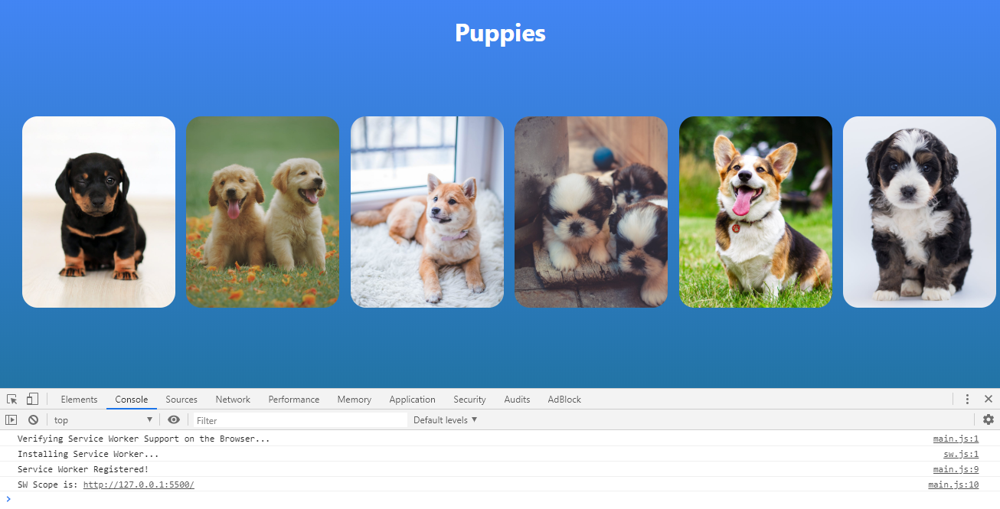
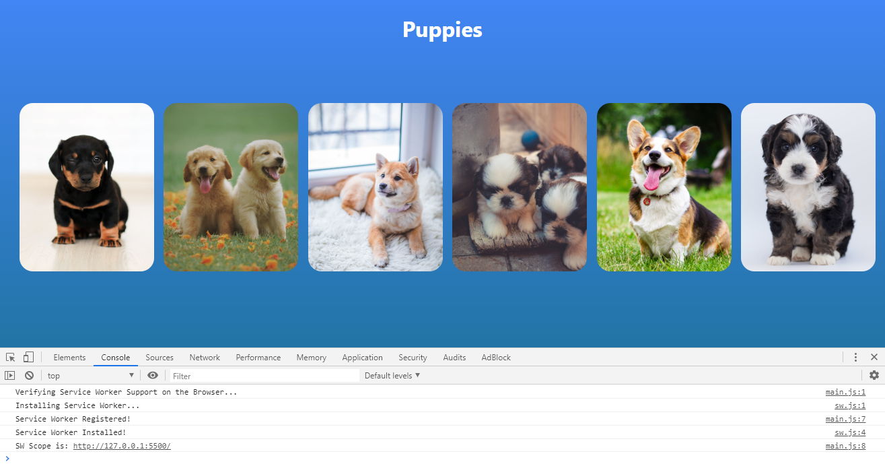
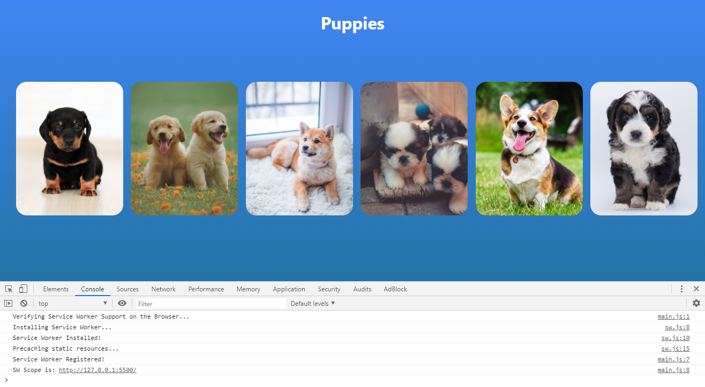
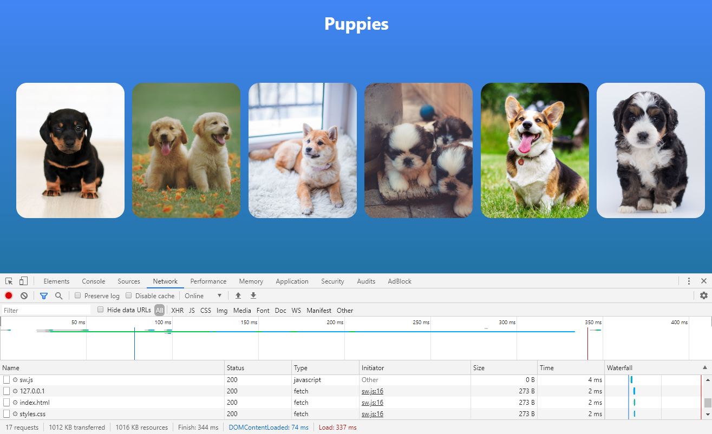
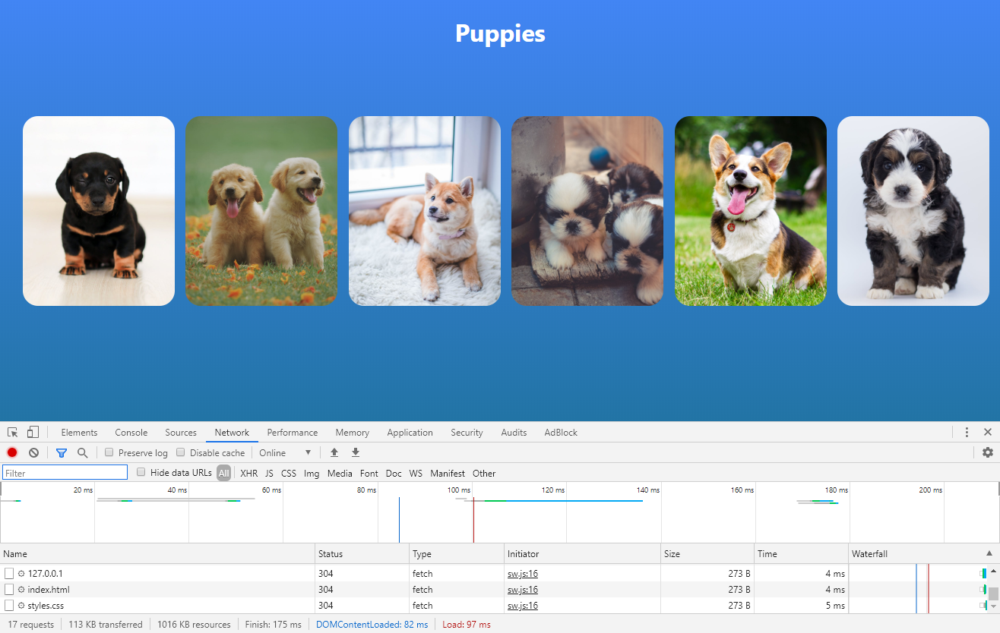
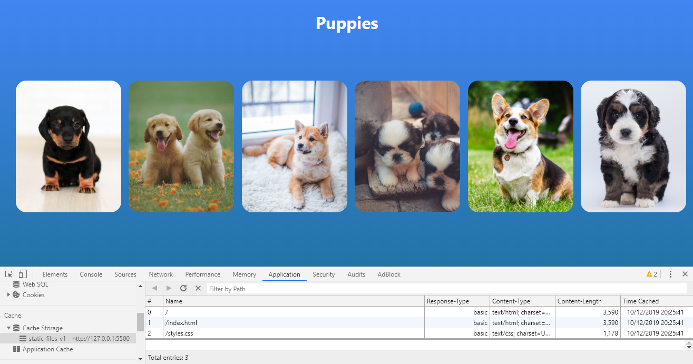

# Service Workers Offline Codelab

Codelab to learn about how Service Workers help us to empower our websites keeping assets on the cache enabling the site to load faster and work without internet connection.

## How it works?

In the master branch you will have the base project without any Service Worker implementation, you will find each of the steps to follow on different branches.

## Steps

- 1. Service Worker Registration

> Service Worker works only on **HTTPS** connection or **localhost**. Not on **file://**

> Visual Studio Code **Live Server** Extension is a good option for testing.

> Service Workers file normally lives at the top level of the app (next to index.html) to cover the whole app.

> Service Workers cannot have a scope above its own path but you can specify to work just on a below path.

- 2. Service Worker Installation

Adding Listener to the install event on the Service Worker.
> The keyword "self" is similiar to "this" when working on a Service Worker.

- 3. Precaching

Download the files that the app needs to run and places them in a cache.

The network ask for the resources and respond with http status code 200(OK).
> If the Service Worker add the resource, we will see a engine next to the name of the resource on Network tab.

The network ask for the resources and respond with http status code 304(Not Modified).
> The resource is already on the cache so it's not modified.

We can have a look to all the resources at the Cache Storage on the Application tab.
> The cache will have the name we definied on the sw.js file.

## Author & Credits

- [William Velazquez](https://williamvelazquez.com/)

## Social Networks

- [Twitter](https://twitter.com/@WilliamVlazquez)
- [Website](https://williamvelazquez.com/)
